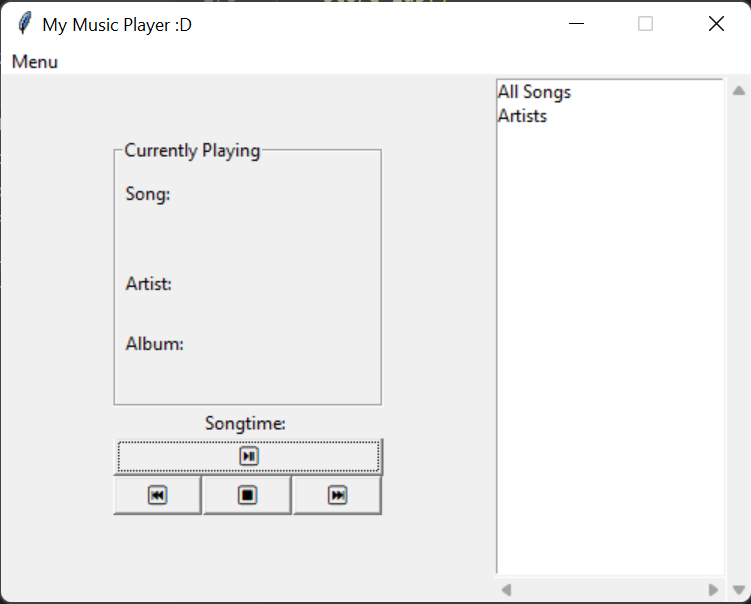
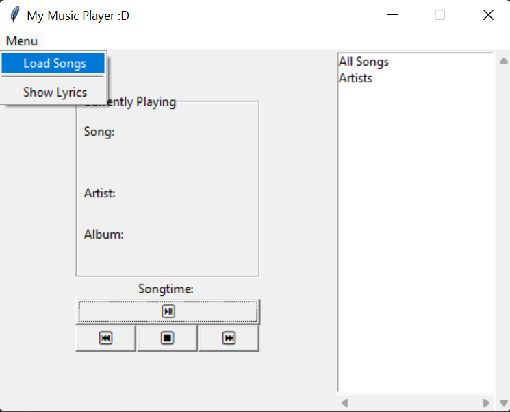
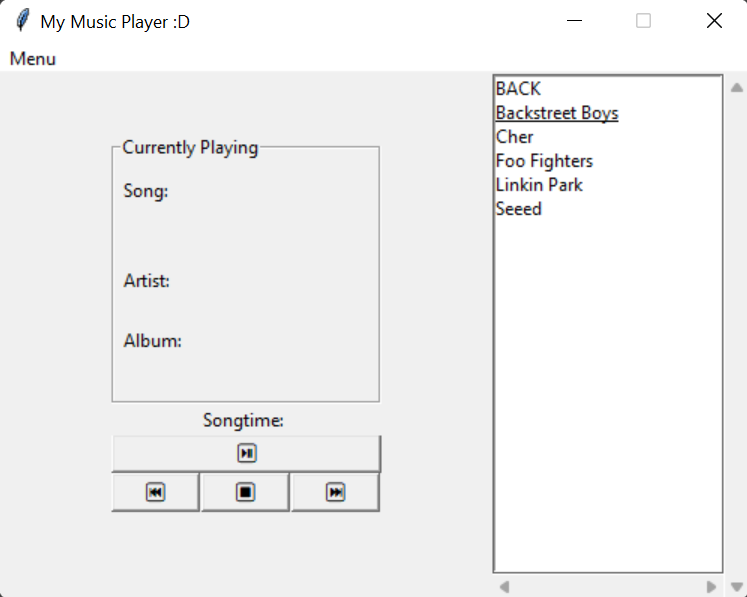
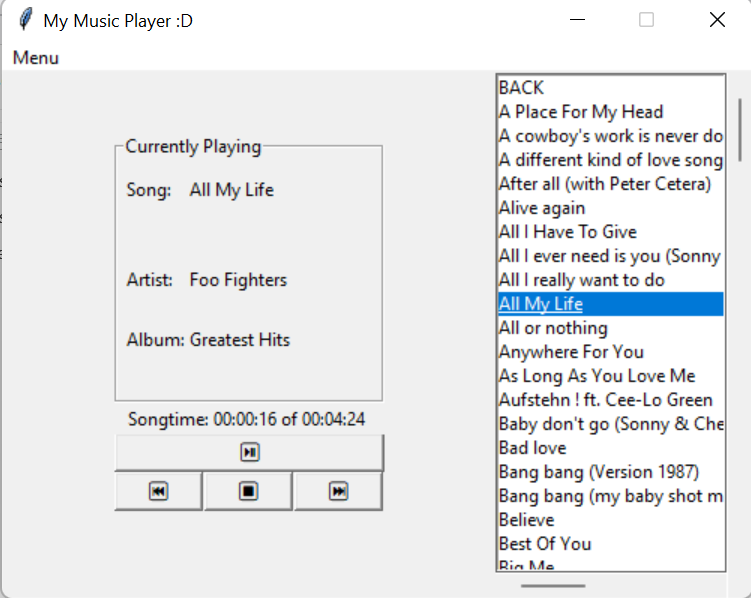
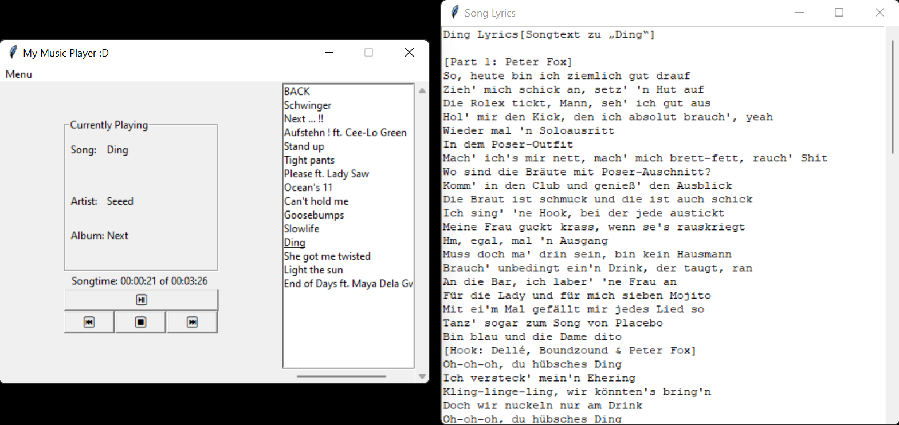

# my_music_player
Python project SS2022

## 1. Goal, Motivation and Structure
The goal with this project was to create a nice music player application for my python coding classes. I always have a music playing device with me at all times. I grew up with the good old windows media player and listend to my favourite music all day. When I got my first MP3 player I was the happiest girl alive. All over the year I lived through 5 generations of MP3 players and I still have one on me everytime I go out. So my passion for listening to music hasn't waned a bit. But every device I owned had a little flaw and I kept thinking about how I would improve it if I were the one designing it. So with this project I got the perfect opportunity to actually design and programm a music player that workes in a way I always hoped it would be. The thing that always bothered me the most was the structuring of the songs. They all provide a stucture where you can choose among the artists, then the artists albums and their songs. But everything is ordered alphabetically. In my opinion albums should be sorted by release year. And finally I managed to do that.

I obviously had to create an interface to work with first, so at the beginning of my code I do exactly that. Afterwards I began to add functionality. To getting started I had to upload some songs and give them the proper structure and display everthing nicely in my player. Only then I could begin with adding and testing the commands for navigating the music, like play/pause, stop, previous song and next song. Now that music was playing I could add the timebar that shows how long a song is playing right now and how long the entire song is. The cherry on top is the option to show lyrics for every playing song.

## 2. System Requirements and Download links
To run the program you should have installed a working Python version (3.7 or higher). As well as the following libraries tkinter, gygame.mixer, mutagen.id3 and mutagen.mp3, lyricsgenius and time. 

If you're using anaconda you can get the music players environment with all libraries from the environment file musicplayer.yaml.
Else you can install the libraries given in the requirements.txt file.

## 3. Instruction for usage
Start the musicplayer by running the main.py file. You will now see the following screen:

Now you can upload your desired songs by clicking on the "Menu" button on the top left and select "Load Songs" (see picture below). You can only upload song files not entire folders with music, so keep that in mind. Also every song has to inherit the information about the artists and albums name, as well as the release year of the album. 

After uploading songs you can use the Menu on the right side with the main options "All Songs" and "Artists". You navigate through this menu by double clicking the desired item. You can use the scrollbar on the right and on the bottom to get a good look at all the songs, artists and albums. Clicking on "All Songs" gives you a list of all the songs you uploaded. With double clicking on one of the songs, the song will start to play. 

Choosing "Artist" gives you a list of all the artist you uploaded (shown below). When choosing an artist you will see all the albums from that artist (of cause only the one you uploaded songs from). Then you can choose the desired album and will see all uploaded songs from that album. Again, now you can start playing a song by double clicking it. To navigate back to the list of albums, artist or the main menu, you can always click the "Back" entry on top of the list.

When you chose a song to start with you can use the Buttons (play/pause, stop, previous, next) which should be self-explanatory. "Previous" gives you the song before the currently playing song if that is possible, else it will jus keep playing the song you are at. Similarly "Next" will start playing the next song in the list, if that is possible. "Stop" will stop the msuic to play. It restarts the song when you press play afterwards. Otherwise the "Play/Pause" button will pause or unpause the song. It is not possible to select and start a new song with the play button. If you want to select a new song from the list, do so by double clicking. Beneath a picture with a playing song.

To wrap up the experience you can also display the lyrics to your favourite song. To do so go to the menu on the top left and select "Show Lyrics". Remember that the player can only show lyrics when you first started to play the song you want the lyrics from. It will take a few seconds till a new window with the lyrics will pop up, similar to the following picture.

Now have fun listening to all your favourite music! :D
